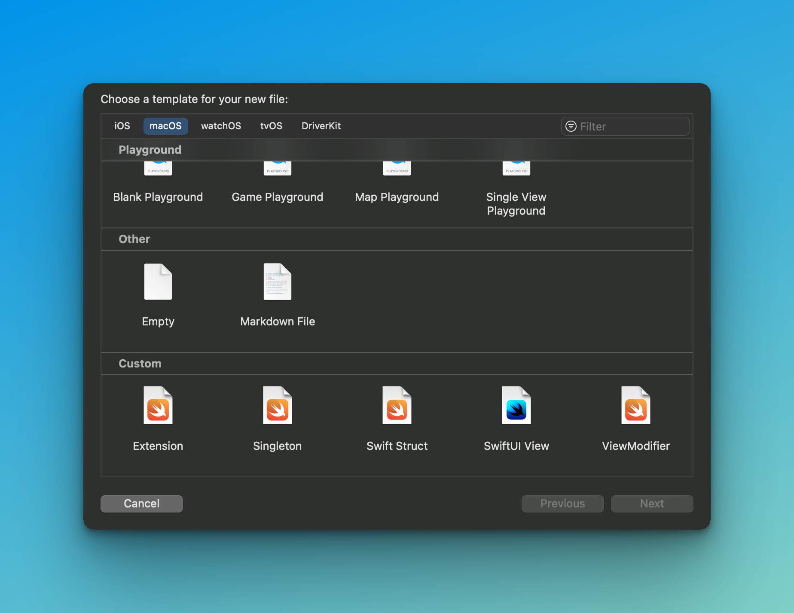

# Xcode File-Templates

The installation includes the following templates:

* Swift Extension
* Swift Singleton
* Swift Struct
* SwiftUI View
* ViewModifier



## Installation

To install these templates just clone this repository to your Mac and run the follwing commands in your terminal:

```Shell
git clone https://github.com/phranck/Xcode-File-Templates.git
cd Xcode-File-Templates
./install.sh
```

The file templates will be installed under:

```shell
~/Library/Developer/Xcode/Templates/File Templates/Custom/
```

Regarding this last path component `Custom/` you'll find it in Xcode under the related category `Custom`. However, this is a default value. Running the install script you will be prompted to give a name for that category.
